# PredNet: Replication, Transfer Learning & Architectural Exploration

**Final Year Project: School of Computer Science and Engineering, NTU Singapore**

---

## Overview

This project replicates **PredNet** (Lotter et al., 2016), a hierarchical predictive coding neural network for unsupervised video prediction. The work is structured in three phases:

1. **Replication:**Reproduce PredNet on the KITTI autonomous driving dataset using a ConvLSTM-based recurrent cell
2. **Transfer Learning:** Investigate whether KITTI-pretrained weights transfer to the Moving MNIST domain (scratch vs. fine-tune)
3. **Architectural Modification:** Replace the ConvLSTM cell with a ConvGRU cell and evaluate performance and parameter efficiency

> **Reference:** Lotter, W., Kreiman, G., & Cox, D. (2016). *Deep Predictive Coding Networks for Video Prediction and Unsupervised Learning.* [arXiv:1605.08104](https://arxiv.org/abs/1605.08104)

---

## Repository Structure

```
.
├── KITTI_Results/               # ConvLSTM results on KITTI
│   ├── kitti_training_curves.png
│   ├── kitti_per_timestep_mse.png
│   ├── kitti_predictions_sample0.png
│   ├── kitti_predictions_sample10.png
│   ├── kitti_predictions_sample50.png
│
├── KITTI_GRU_Results/           # ConvGRU results on KITTI
│   ├── kitti_training_curves.png
│   ├── kitti_per_timestep_mse.png
│   ├── kitti_predictions_sample0.png
│   ├── kitti_predictions_sample10.png
│   ├── kitti_predictions_sample50.png
│
├── MNIST_Results/               # ConvLSTM results on Moving MNIST (scratch & fine-tune)
│   ├── fig1_training_convergence.png
│   ├── fig2_per_timestep_mse.png
│   ├── fig3_multi_sample_sequences.png
│   ├── fig4_error_heatmaps.png
│   ├── fig5_ssim_per_timestep.png
│   ├── fig6_detailed_sequence.png
│   └── fig7_results_table.png
│
└── MNIST_GRU_Results/           # ConvGRU results on Moving MNIST (scratch & fine-tune)
    ├── fig1_training_convergence.png
    ├── fig2_per_timestep_mse.png
    ├── fig3_multi_sample_sequences.png
    ├── fig4_error_heatmaps.png
    ├── fig5_ssim_per_timestep.png
    ├── fig6_detailed_sequence.png
    └── fig7_results_table.png
```

---

#### Training Curves: KITTI

| ConvLSTM | ConvGRU |
|:---:|:---:|
| 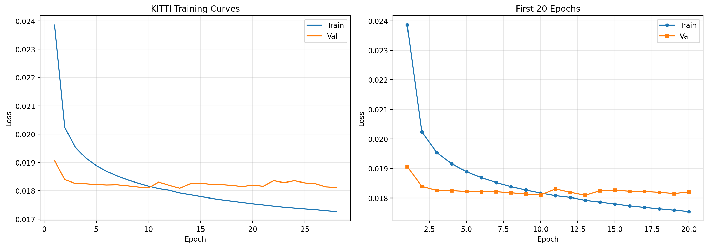 | 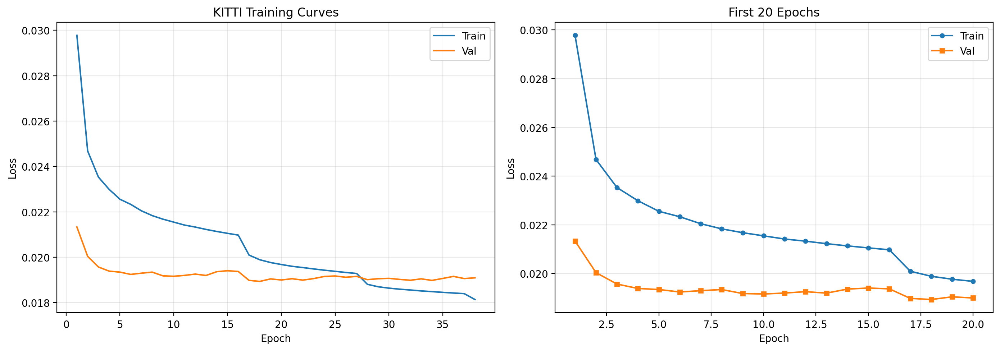 |

#### Per-Timestep MSE: KITTI

| ConvLSTM | ConvGRU |
|:---:|:---:|
| 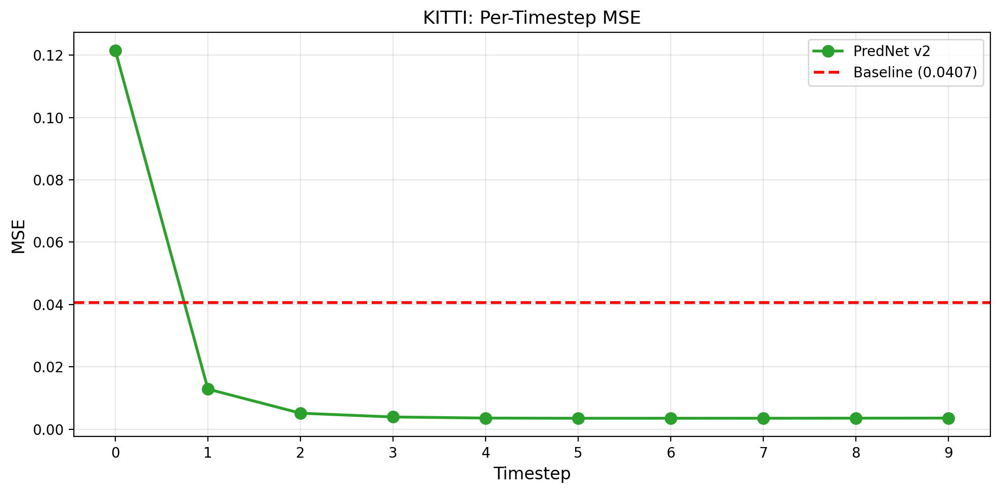 | 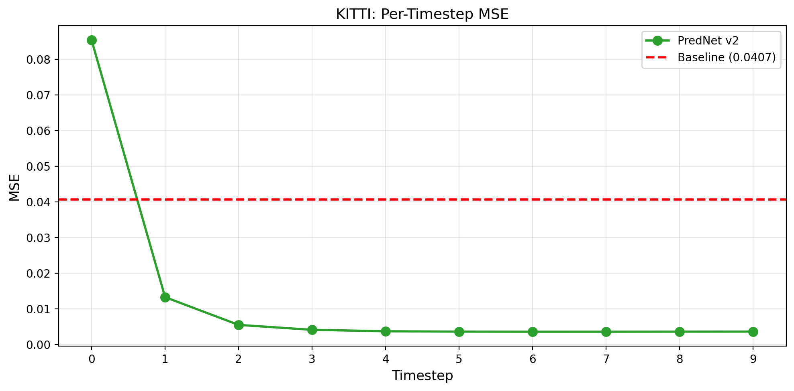 |

#### Sample Predictions: KITTI

| ConvLSTM | ConvGRU |
|:---:|:---:|
| 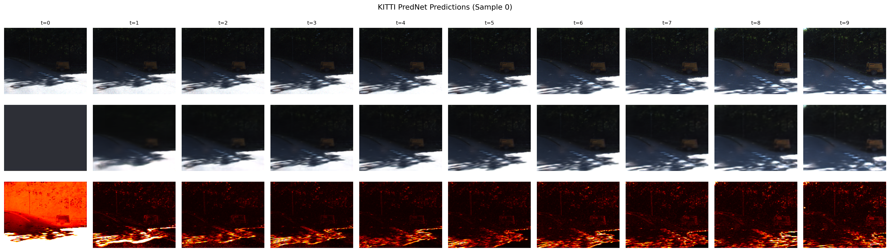 | 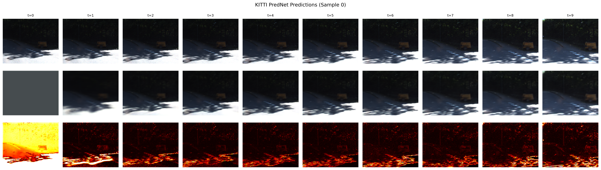 |

---

### Phase 2: Moving MNIST Transfer Learning (Scratch vs. Fine-Tune)

All models trained for 50 epochs on Moving MNIST. Fine-tune models are initialised from KITTI-pretrained weights.

**Key finding:** Scratch training consistently outperforms fine-tuning for both architectures. KITTI-pretrained features are domain-specific (real-world textures, ego-motion) and do not transfer to the abstract Moving MNIST domain, causing fine-tuned models to converge to suboptimal solutions.

#### Training Convergence: Moving MNIST

| ConvLSTM | ConvGRU |
|:---:|:---:|
| 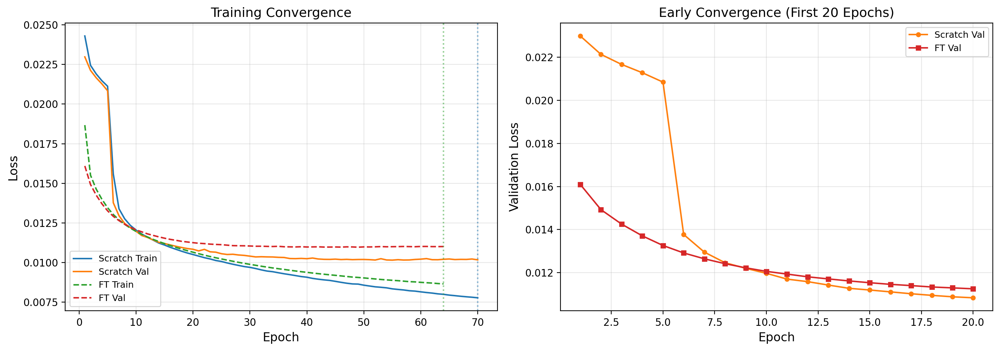 | 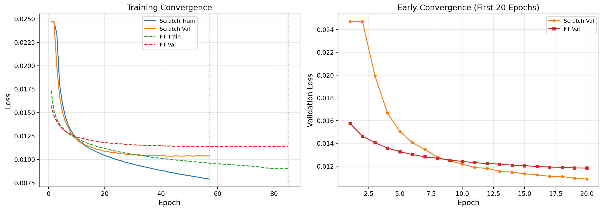 |

#### Per-Timestep MSE: Moving MNIST

| ConvLSTM | ConvGRU |
|:---:|:---:|
| 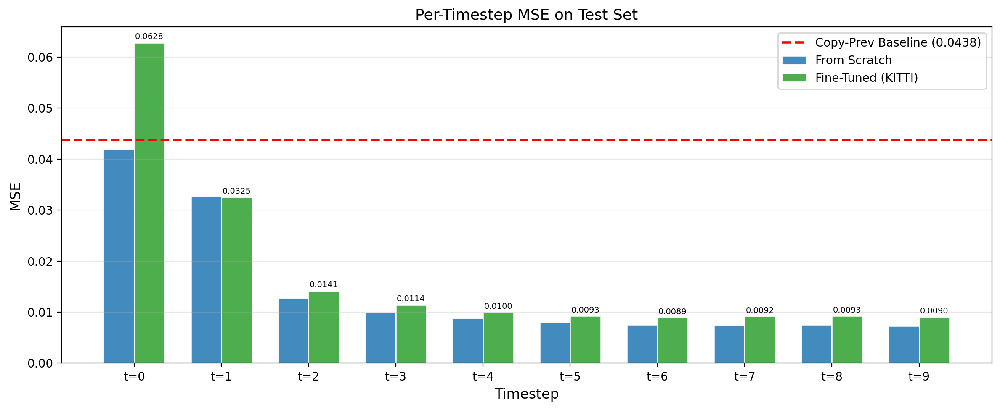 | 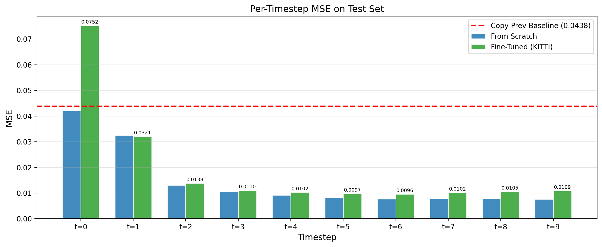 |

#### Multi-Sample Prediction Sequences

| ConvLSTM | ConvGRU |
|:---:|:---:|
| 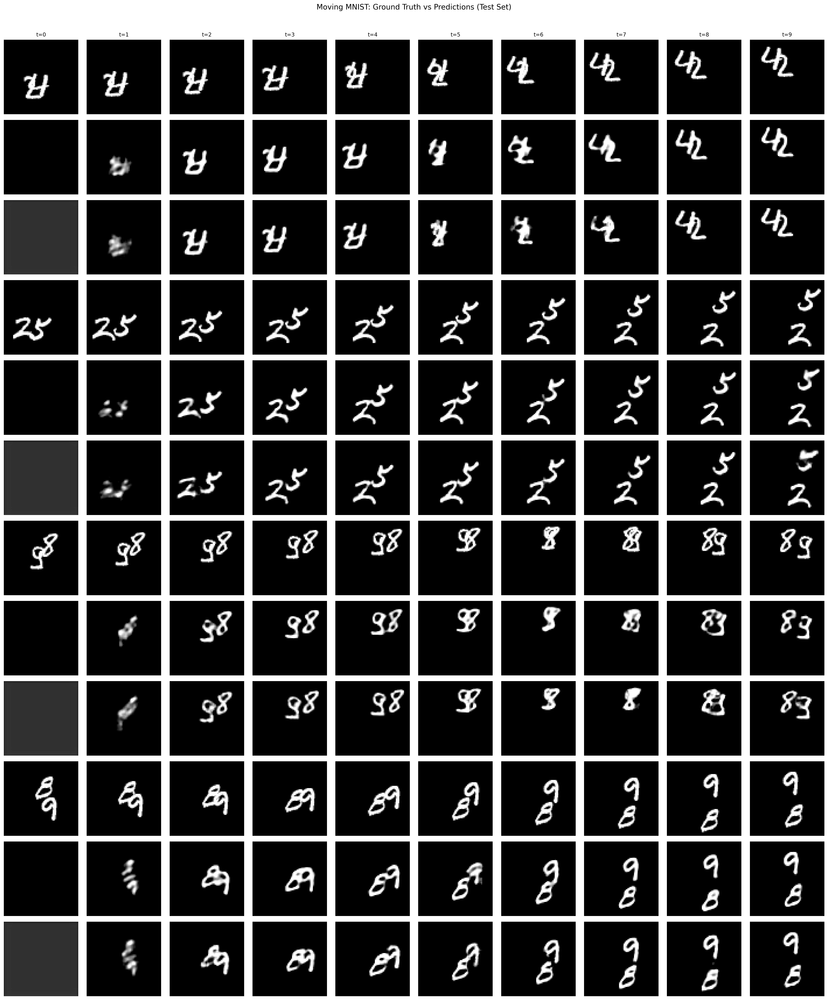 | 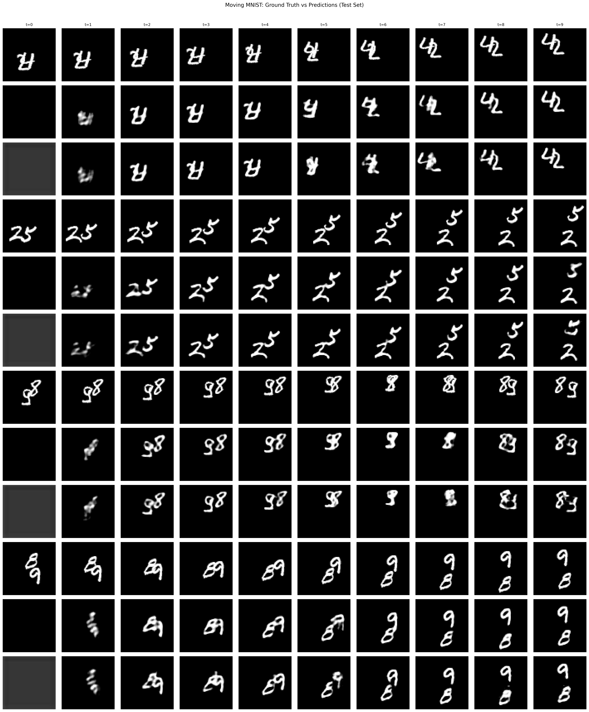 |

#### Error Heatmaps

| ConvLSTM | ConvGRU |
|:---:|:---:|
| 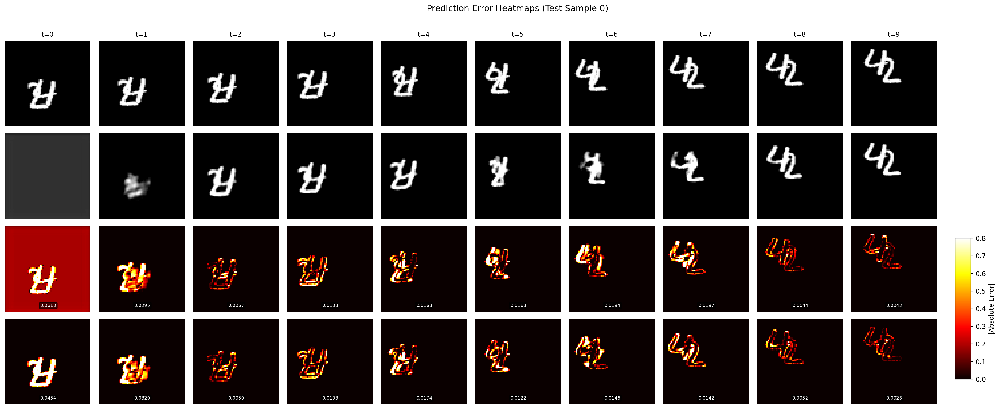 | 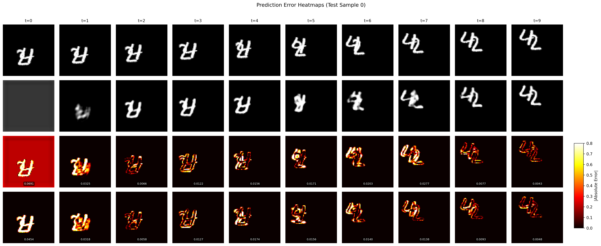 |

#### SSIM Per Timestep

| ConvLSTM | ConvGRU |
|:---:|:---:|
| 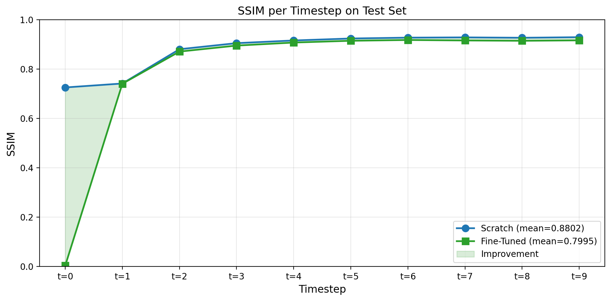 | 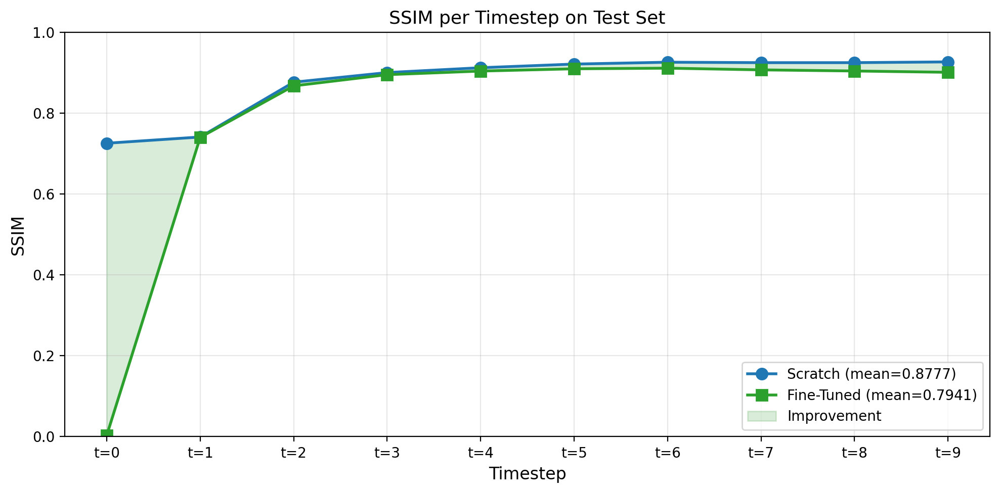 |

#### Detailed Prediction Sequence

| ConvLSTM | ConvGRU |
|:---:|:---:|
|  | 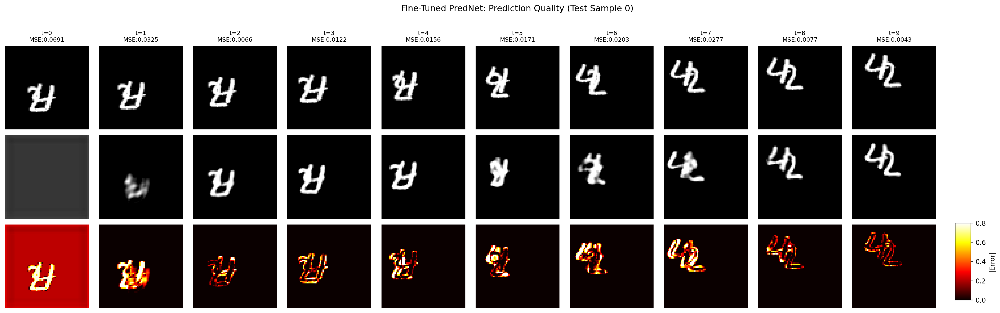 |

#### Summary Results Table

| ConvLSTM | ConvGRU |
|:---:|:---:|
| 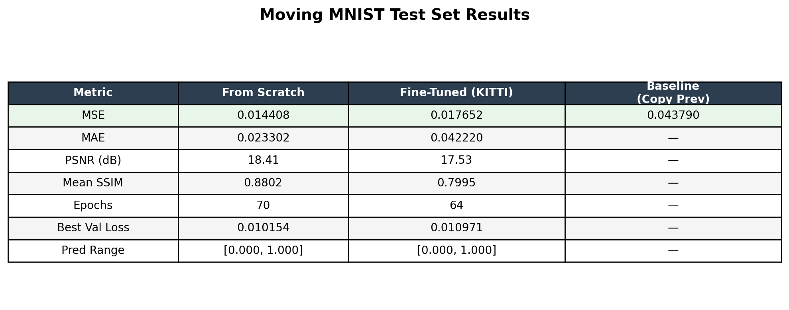 | 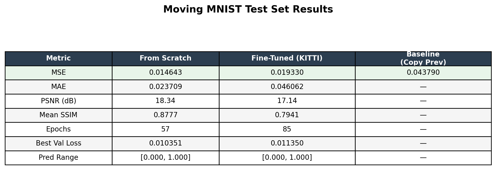 |

---
